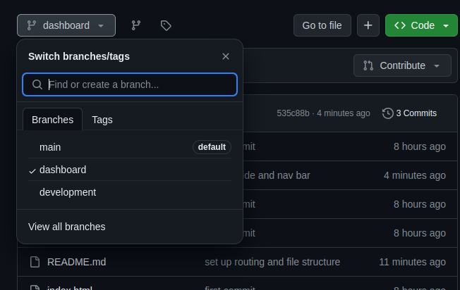
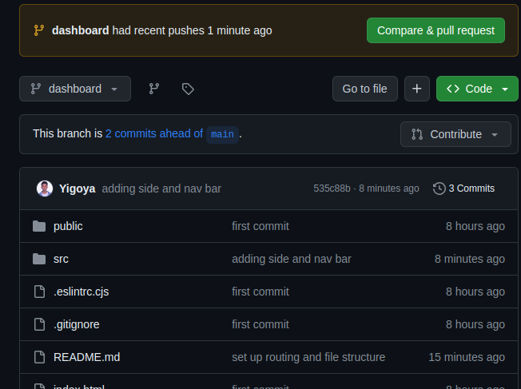
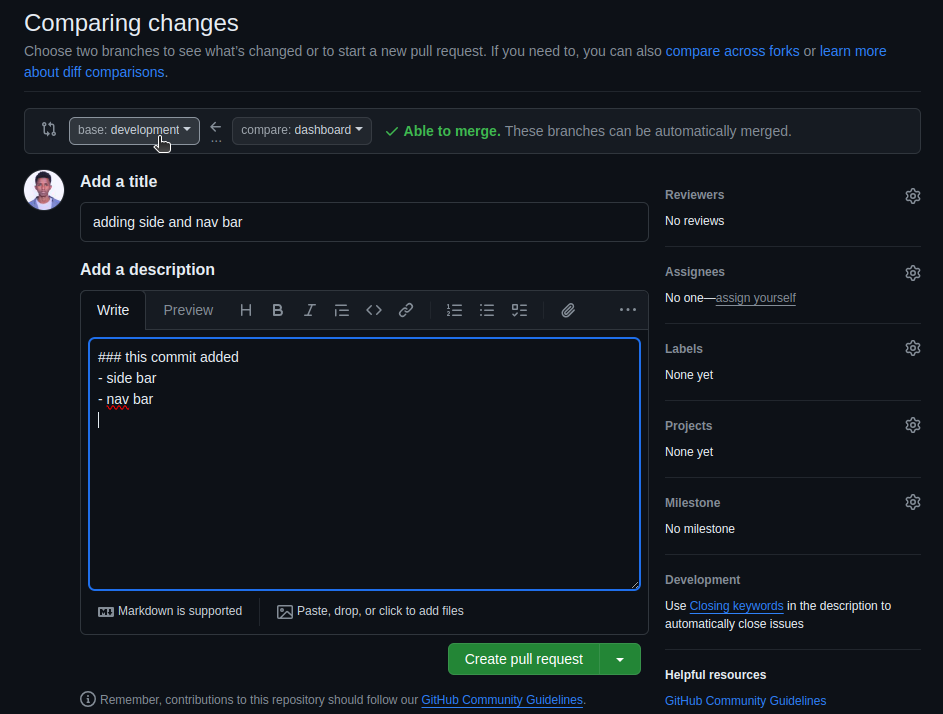

# FDRE prison College managment system Frontend

welcome to FDRE college system build using React, tailwind and vite
this system dedicated to FDRE aliti prison prisoners to control and manage Educational process

## Get Started

these are instructions will guide you to set up and run in your local machine.

### Prerequisites

- node js

### installection

1. Clone the repository:

```
    git clone https://github.com/Yigoya/federal-prison-education-ms-frontend.git

    cd federal-prison-education-ms-frontend

    npm i
```

2. Run Application: `npm run dev`

## Folder Structure

The project follows a well-organized directory structure to maintain a clean and efficient codebase.

- public: Contains static files accessible to the public, such as index.html and other assets.

- src: The main source code directory.

  - assets: Static assets like images, videos, and more.
  - components: Reusable UI components.
  - common: Shared components like Header, Footer, etc.
  - pages: Individual pages of the application.
  - utils: Utility functions and helpers.
  - App.jsx: Main application component for routing and layout.
  - index.jsx: Entry point of the application.

- .gitignore: List of files and folders to be ignored by Git.

- package.json: Project configuration and dependencies.

- tailwind.config.js: configure file for tailwind css

- vite.config.js: Vite configuration.

- README.md: Documentation for the project.

## Rules needs to follow

- don't push to main branch
- the development branch is the branch we use until we are ready to deploy

### step by step for pushing your code to github

let's say i'm working on dashboard page and after a finish my some feature and wanna push

1. creating local branch: `git checkout -b dashboard`
2. add changes: `git add .`
3. commit your change and your comment has to be explanatory: `git commit -m "adding side and nav bar"`
4. push to github: ` git push origin dashboard`
5. select your branch:
   
6. click to compare and pull request:
   
7. creating pull request:

- select development branch for base (where the cursor at)
- add title and description that explain the change
- click Create pull request
  
  the rest is for reviews

## happy coding :heart:
